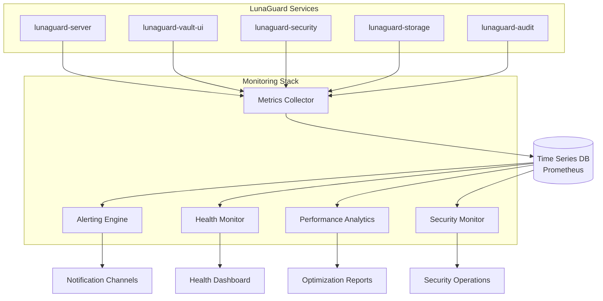

# LunaGuard Monitoring Services 📊

Comprehensive monitoring, alerting, and observability microservices for the LunaGuard platform, built in Python to provide real-time insights, performance monitoring, and proactive incident management.

## 🎯 Service Overview

The **LunaGuard Monitoring** suite provides enterprise-grade observability across the entire LunaGuard ecosystem, ensuring optimal performance, security monitoring, and proactive issue detection.

## 🔍 Monitoring Philosophy

### Three Pillars of Observability

1. **Metrics**: Quantitative measurements of system behavior
2. **Logs**: Detailed records of system events and transactions
3. **Traces**: Request flow tracking across distributed services

### Proactive vs Reactive

- **Proactive**: Predictive analytics and anomaly detection
- **Reactive**: Real-time alerting and incident response
- **Continuous**: 24/7 monitoring with automated remediation

## 🚀 Planned Microservices

### 1. **Metrics Collection Service** (`lunaguard-metrics-collector`)

**Purpose**: Centralized collection and aggregation of system and business metrics

#### Features:

- **System Metrics**: CPU, memory, disk, network utilization
- **Application Metrics**: Response times, error rates, throughput
- **Business Metrics**: User activity, secret operations, compliance scores
- **Custom Metrics**: Configurable business-specific measurements
- **Time Series Storage**: High-performance time series database integration

#### Collected Metrics:

```yaml
System Metrics:
  - cpu_usage_percent
  - memory_usage_bytes
  - disk_io_operations
  - network_bytes_transmitted

Application Metrics:
  - request_duration_seconds
  - request_count_total
  - error_rate_percent
  - active_connections

Business Metrics:
  - secrets_created_total
  - user_logins_total
  - compliance_score
  - security_incidents_total
```

### 2. **Alerting Engine** (`lunaguard-alerting`)

**Purpose**: Intelligent alerting system with escalation and notification management

#### Features:

- **Smart Thresholds**: Dynamic thresholds based on historical data
- **Alert Correlation**: Grouping related alerts to reduce noise
- **Escalation Policies**: Multi-tier escalation with different notification channels
- **Alert Fatigue Prevention**: Intelligent alert suppression and batching
- **Integration Hub**: Multiple notification channels and external integrations

#### Alert Types:

- **Critical**: Service outages, security breaches, data corruption
- **Warning**: Performance degradation, approaching limits
- **Info**: Maintenance events, deployment notifications
- **Predictive**: Forecasted issues based on trend analysis

#### Notification Channels:

- **Email**: Traditional email notifications with rich formatting
- **Slack/Teams**: Real-time chat integrations with interactive responses
- **SMS**: Critical alerts via text message
- **Webhook**: Integration with external incident management systems
- **Mobile Push**: Mobile app notifications for on-call staff

### 3. **Health Check Service** (`lunaguard-health-monitor`)

**Purpose**: Comprehensive health monitoring and service dependency tracking

#### Features:

- **Service Health**: Individual microservice health and availability
- **Dependency Mapping**: Service dependency visualization and monitoring
- **Synthetic Monitoring**: Simulated user transactions and workflows
- **SLA Monitoring**: Service level agreement tracking and reporting
- **Cascading Failure Detection**: Identifying and preventing cascade failures

#### Health Check Types:

- **Liveness Probes**: Basic service availability checks
- **Readiness Probes**: Service readiness for handling requests
- **Dependency Checks**: External service and database connectivity
- **Performance Checks**: Response time and throughput validation
- **Business Logic Checks**: Critical workflow functionality validation

### 4. **Performance Analytics** (`lunaguard-performance`)

**Purpose**: Advanced performance analysis and optimization recommendations

#### Features:

- **Performance Profiling**: Detailed application performance analysis
- **Bottleneck Detection**: Automated identification of performance bottlenecks
- **Capacity Planning**: Resource usage forecasting and scaling recommendations
- **Optimization Suggestions**: AI-powered performance improvement recommendations
- **Benchmark Tracking**: Performance baseline establishment and tracking

#### Analysis Areas:

- **Database Performance**: Query optimization and index recommendations
- **API Performance**: Endpoint response time analysis and optimization
- **Resource Utilization**: CPU, memory, and storage efficiency analysis
- **User Experience**: Frontend performance and user interaction metrics

### 5. **Security Monitoring** (`lunaguard-security-monitor`)

**Purpose**: Real-time security event monitoring and threat detection

#### Features:

- **Threat Detection**: Real-time analysis of security events and patterns
- **Intrusion Detection**: Network and application-level intrusion monitoring
- **Vulnerability Scanning**: Automated security vulnerability assessments
- **Incident Response**: Automated response to security threats
- **Security Metrics**: Security posture measurement and reporting

#### Security Events:

- **Authentication Failures**: Failed login attempts and brute force detection
- **Authorization Violations**: Unauthorized access attempts
- **Data Access Patterns**: Unusual data access or download activities
- **Network Anomalies**: Suspicious network traffic patterns
- **Configuration Changes**: Unauthorized system configuration modifications

## 🏗️ Architecture Integration



## 📊 Monitoring Dashboard

### Executive Dashboard

- **System Overview**: High-level health and performance indicators
- **Business Metrics**: User activity, revenue impact, growth trends
- **Incident Summary**: Current incidents and resolution status
- **Compliance Status**: Regulatory compliance health scores

### Operations Dashboard

- **Service Health**: Real-time status of all microservices
- **Performance Metrics**: Response times, throughput, error rates
- **Infrastructure**: Server utilization, database performance
- **Alert Status**: Active alerts and escalation status

### Security Dashboard

- **Threat Overview**: Current security threats and incidents
- **Access Patterns**: User authentication and authorization analytics
- **Vulnerability Status**: Security scan results and remediation progress
- **Compliance Metrics**: Security policy compliance scores

### Developer Dashboard

- **Application Performance**: Detailed performance metrics per service
- **Error Tracking**: Error rates, stack traces, and resolution status
- **Deployment Metrics**: Deployment frequency and success rates
- **Code Quality**: Code coverage, test results, security scan results

## 🔔 Alert Management

### Alert Severity Levels

```yaml
Critical (P1):
  - Response Time: 15 minutes
  - Escalation: Immediate to on-call engineer
  - Examples: Service outage, security breach, data loss

High (P2):
  - Response Time: 1 hour
  - Escalation: To team lead after 30 minutes
  - Examples: Performance degradation, partial outage

Medium (P3):
  - Response Time: 4 hours
  - Escalation: To team during business hours
  - Examples: Resource utilization warnings, minor issues

Low (P4):
  - Response Time: 24 hours
  - Escalation: Informational, no immediate action required
  - Examples: Maintenance notifications, trend alerts
```

### Smart Alerting Features

- **Alert Grouping**: Related alerts grouped to reduce noise
- **Flapping Detection**: Prevents alerts for oscillating conditions
- **Maintenance Windows**: Suppresses alerts during planned maintenance
- **Dependency Awareness**: Suppresses downstream alerts when upstream services fail

## 🚀 Implementation Roadmap

### Phase 1: Core Monitoring (MVP)

1. **Metrics Collection Service** - Basic system and application metrics
2. **Health Check Service** - Service availability monitoring
3. **Basic Alerting** - Essential alert notifications

### Phase 2: Advanced Analytics

4. **Performance Analytics** - Detailed performance analysis and optimization
5. **Security Monitoring** - Real-time security event monitoring
6. **Advanced Dashboards** - Comprehensive monitoring dashboards

### Phase 3: Intelligent Features

7. **Predictive Analytics** - AI-powered anomaly detection and forecasting
8. **Automated Remediation** - Self-healing capabilities for common issues
9. **Advanced Integrations** - ITSM and external tool integrations

### Phase 4: Enterprise Features

10. **Multi-tenancy** - Customer-specific monitoring and alerting
11. **Global Monitoring** - Multi-region monitoring and coordination
12. **Advanced AI** - Machine learning for pattern recognition and optimization

## 🔧 Technology Stack

### Core Technologies

- **Runtime**: Python 3.9+ with async frameworks
- **Web Framework**: FastAPI for monitoring APIs
- **Time Series Database**: Prometheus for metrics storage
- **Visualization**: Grafana for dashboards and alerting
- **Message Queue**: Redis for real-time event processing

### Data Processing

- **Stream Processing**: Apache Kafka for real-time event streaming
- **Batch Processing**: Apache Airflow for scheduled analytics
- **Machine Learning**: scikit-learn, TensorFlow for predictive analytics
- **Database**: PostgreSQL for configuration and metadata storage

## 📈 Performance Requirements

### Metrics Ingestion

- **Target Throughput**: 100,000+ metrics per second
- **Latency**: < 1 second from metric generation to storage
- **Retention**: 1 year of detailed metrics, 5 years of aggregated data

### Alert Processing

- **Response Time**: < 30 seconds from threshold breach to notification
- **Reliability**: 99.9% alert delivery success rate
- **Scalability**: Support for 10,000+ alert rules

### Dashboard Performance

- **Load Time**: < 3 seconds for dashboard rendering
- **Refresh Rate**: Real-time updates with < 5 second delay
- **Concurrent Users**: Support for 500+ concurrent dashboard users

## 🛡️ Security Considerations

### Data Protection

- **Encryption**: All monitoring data encrypted at rest and in transit
- **Access Controls**: Role-based access to monitoring data and dashboards
- **Data Retention**: Secure deletion of expired monitoring data
- **Privacy**: No sensitive data in metrics or logs

### Monitoring Security

- **Secure Communications**: TLS encryption for all monitoring communications
- **Authentication**: Strong authentication for monitoring system access
- **Audit Logging**: All monitoring system access and changes logged
- **Incident Response**: Security incident detection and automated response
