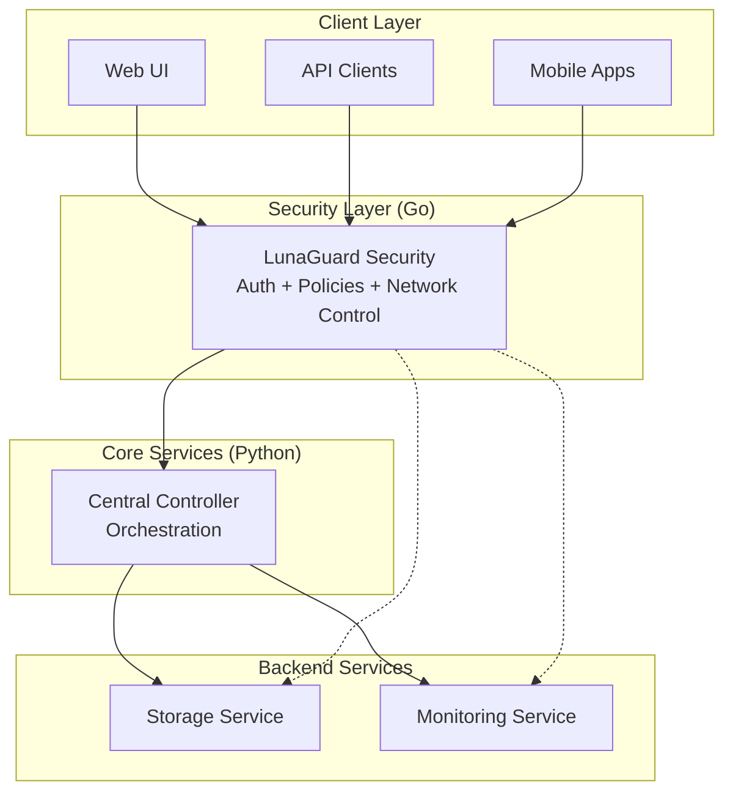

# LunaGuard Security Service

The comprehensive security and authentication service for the LunaGuard platform, built in Go to provide high-performance authentication, authorization, network control, and security policy enforcement.

## 🎯 Service Overview

The **LunaGuard Security** service combines authentication, authorization, and advanced security features into a single high-performance Go service:

## 🔐 Core Responsibilities

### 1. **Authentication & Authorization**

- **Dual Authentication System**
  - 🔐 Local Authentication: Email/password with JWT tokens
  - 🌐 OAuth 2.0: Google OAuth (extensible to GitHub, Apple, etc.)
- **🔒 Security First**
  - JWT access tokens (15-min expiry) + refresh tokens (7-day expiry)
  - HttpOnly cookies for OAuth flow security
  - bcrypt password hashing
  - Token rotation and revocation
  - Device tracking and session management

### 2. **Network Control & Policies** (planned)

- **Access Control Lists (ACLs)**
  - IP-based access restrictions
  - Geo-location filtering
  - Time-based access policies
  - Device fingerprinting and allowlisting
- **Rate Limiting & DDoS Protection**
  - Adaptive rate limiting per user/IP
  - Distributed rate limiting across instances
  - Automatic threat detection and blocking
  - Traffic shaping and prioritization

### 3. **Security Policy Enforcement** (planned)

- **Policy Engine**
  - RBAC (Role-Based Access Control)
  - ABAC (Attribute-Based Access Control)
  - Dynamic policy evaluation
  - Policy inheritance and delegation
- **Compliance & Auditing**
  - Security event logging
  - Real-time security monitoring
  - Automated incident response

### 4. **Advanced Security Features** (planned)

- **Threat Detection**
  - Anomaly detection for login patterns
  - Brute force attack prevention
  - Session hijacking detection
  - Suspicious activity alerting
- **Zero Trust Architecture**
  - Continuous authentication verification
  - Micro-segmentation support
  - Context-aware access decisions
  - Trust score calculation

## 🏗️ Architecture Integration



The security service acts as the primary gateway, validating all requests before forwarding them to the central controller.

## � Features

### Authentication System

- **JWT Token Management**

  - Access tokens (15-minute expiry) for API requests
  - Refresh tokens (7-day expiry) for token renewal
  - Token rotation and revocation
  - Secure token storage and validation

- **OAuth 2.0 Integration**

  - Google OAuth with PKCE
  - Extensible to GitHub, Apple, Microsoft
  - HttpOnly cookies for web security
  - State parameter validation

- **Multi-Factor Authentication (Planned)**
  - TOTP (Time-based One-Time Password)
  - SMS verification
  - Hardware security keys (WebAuthn)
  - Backup codes

## 📡 API Endpoints

### Base URL

```
http://localhost:8080
```

### Authentication Endpoints

#### 🆕 Register New User

```http
POST /auth/register
Content-Type: application/json

{
  "email": "user@example.com",
  "password": "securepassword123",
  "name": "John Doe"
}
```

#### 🔑 Login User

```http
POST /auth/login
Content-Type: application/json

{
  "email": "user@example.com",
  "password": "securepassword123"
}
```

#### 🔄 Refresh Token

```http
POST /auth/refresh
Content-Type: application/json
Authorization: Bearer {refresh_token}
```

#### 🌐 OAuth Routes

```http
GET /auth/google                    # Start Google OAuth
GET /auth/google/callback           # OAuth callback
POST /auth/logout                   # Logout (clears cookies)
GET /auth/user                      # Current user info
```
