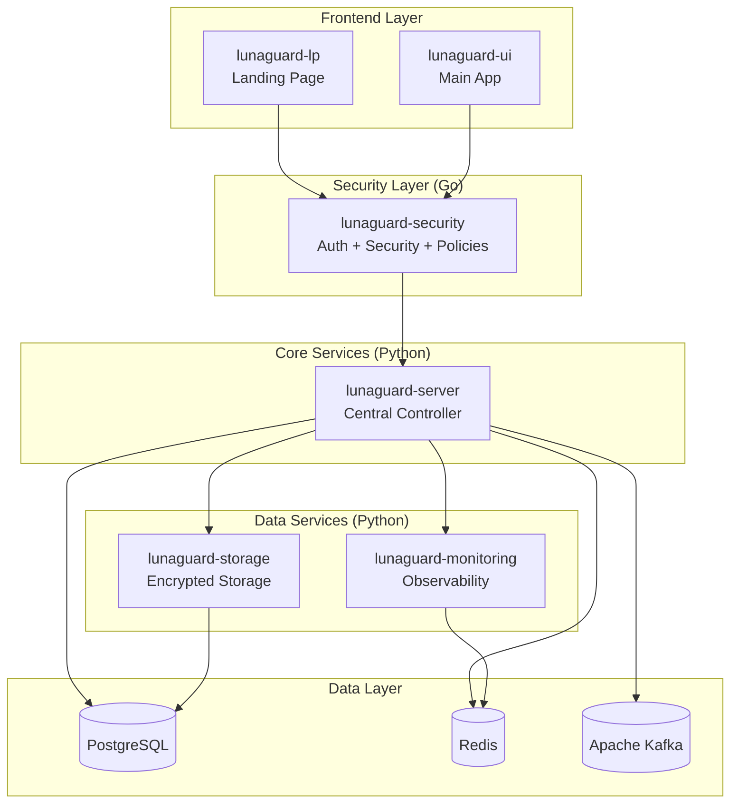

# LunaGuard Server 🐍

The central orchestration and cryptographic service for the LunaGuard microservices platform. Built with Python, this service acts as the main controller, managing encryption/decryption operations and coordinating between all microservices.

## 🎯 Service Overview

**LunaGuard Server** serves as the **central brain** of the LunaGuard ecosystem. As part of the microservices architecture, this Python-based service focuses on:

- **Primary Role**: Central controller and orchestrator for all LunaGuard services
- **Core Responsibility**: Advanced encryption/decryption operations and key management
- **Coordination Role**: Managing communication and workflows between microservices
- **Data Management**: Secure data processing and transformation across the platform

## 🚀 Features

- **🎛️ Central Service Orchestration**
  - Microservice workflow coordination
  - Inter-service communication management
  - Load balancing and service discovery
  - Health monitoring and automatic recovery
- **🔐 Advanced Cryptographic Operations**
  - AES-256-GCM encryption/decryption
  - RSA key pair generation and management
  - Cryptographic key rotation and lifecycle management
- **📊 Data Processing Engine**
  - Secure data transformation pipelines
  - Batch processing for large secret operations
  - Real-time data streaming and processing
  - Encrypted data backup and recovery
- **🔗 Microservice Management**
  - Service registration and discovery
  - API gateway functionality
  - Rate limiting and traffic shaping
  - Circuit breaker patterns for resilience
- **📈 Performance & Monitoring**
  - Async processing with Celery/Redis
  - FastAPI with high-performance endpoints
  - Comprehensive logging and metrics
  - Real-time system health dashboards

## 🏗️ Architecture Context



This service acts as the central orchestrator, handling all complex operations and coordinating between specialized microservices.

## 🚀 Quick Start

### Prerequisites

- Python 3.9+
- PostgreSQL 13+
- Redis 6+
- Docker & Docker Compose (optional)

### 1. Clone and Setup

```bash
git clone https://github.com/LunaGuard/lunaguard-server.git
cd lunaguard-server
python -m venv venv
source venv/bin/activate  # Linux/Mac
# venv\Scripts\activate   # Windows
pip install -r requirements.txt
cp .env.example .env
# Edit .env with your configuration
```

### 2. Install Dependencies

```bash
pip install -r requirements.txt
pip install -r requirements-dev.txt  # for development
```

### 3. Start Services (Docker)

```bash
docker-compose up -d postgres redis
```

### 4. Run Server

```bash
uvicorn main:app --reload --host 0.0.0.0 --port 8000
```

Server starts at `http://localhost:8000`

## 🔐 Cryptographic Operations

### Advanced Encryption Algorithms

- **AES-256-GCM**: Authenticated encryption with additional data (AEAD)
- **ChaCha20-Poly1305**: Modern stream cipher with authentication
- **RSA-4096**: Asymmetric encryption for key exchange
- **ECDSA/ECDH**: Elliptic curve cryptography for performance
- **Argon2id**: Memory-hard key derivation function
- **PBKDF2**: PKCS #5 key stretching with configurable iterations

### Key Management

- **Hierarchical Deterministic (HD) Keys**: BIP32-style key derivation
- **Key Rotation**: Automatic and manual key rotation workflows
- **Hardware Security Module (HSM)**: Ready for HSM integration
- **Key Escrow**: Secure key backup and recovery mechanisms
- **Perfect Forward Secrecy**: Session keys that can't be retroactively decrypted

### Cryptographic Protocols

- **HKDF**: HMAC-based Key Derivation Function (RFC 5869)
- **Noise Protocol**: Modern cryptographic handshake framework
- **Double Ratchet**: Signal-style forward-secure messaging
- **Zero-Knowledge Proofs**: Privacy-preserving verification (planned)

## 🎛️ Microservice Management

### Service Discovery

- **Automatic Registration**: Services auto-register on startup
- **Health Monitoring**: Continuous health checks with circuit breakers
- **Load Balancing**: Round-robin and weighted routing algorithms
- **Service Mesh Ready**: Compatible with Istio/Envoy patterns

### Inter-Service Communication

- **gRPC**: High-performance, strongly-typed service communication
- **Message Queues**: Redis/RabbitMQ for async processing
- **Event Streaming**: Kafka for real-time event processing
- **API Gateway**: Centralized routing and rate limiting

### Configuration Management

- **Environment-Based Config**: Development, staging, production profiles
- **Secret Injection**: Secure configuration delivery to services
- **Hot Reloading**: Runtime configuration updates without restarts
- **Validation**: Schema validation for all configuration changes

### Monitoring & Observability

- **Distributed Tracing**: OpenTelemetry with Jaeger/Zipkin
- **Metrics Collection**: Prometheus-compatible metrics export
- **Structured Logging**: JSON logs with correlation IDs
- **SLA Monitoring**: Service level agreement tracking and alerting
