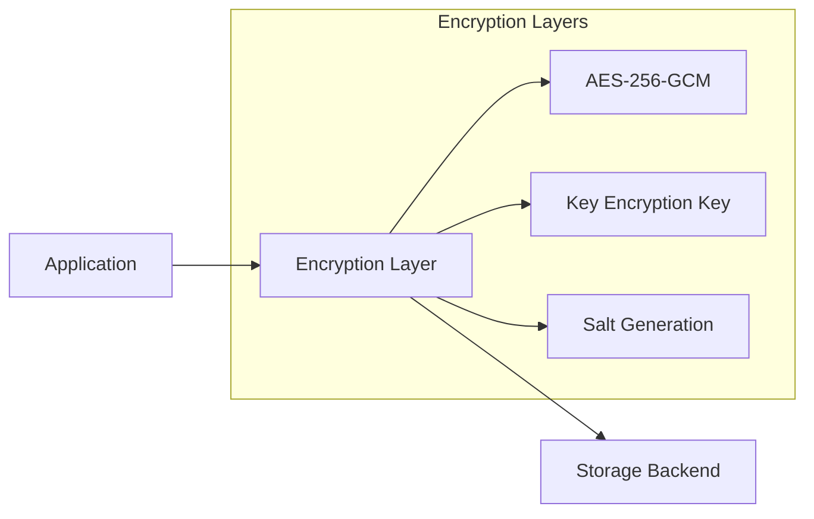
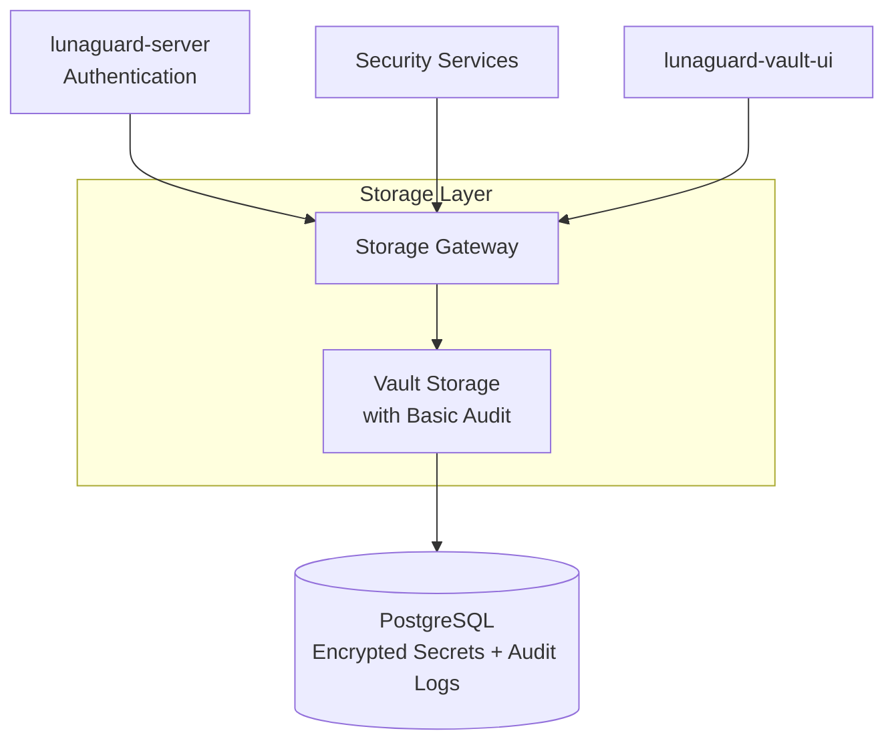

# LunaGuard Storage Services 💾

Secure storage backends and data management microservices for the LunaGuard platform, built in Python to provide scalable, encrypted, and tamper-evident storage solutions.

## 🎯 Service Overview

The **LunaGuard Storage** suite provides the backbone for secure data persistence across the LunaGuard ecosystem. These Python-based microservices handle different types of data with appropriate security guarantees.

## 🏗️ Storage Architecture

LunaGuard requires **two distinct storage backends** with different security and performance characteristics:

### 1. **Secrets Storage Service** (`lunaguard-vault-storage`)

**Purpose**: Encrypted storage for sensitive secrets and credentials

#### Backend Options:

- **Etcd** - Battle-tested, Kubernetes-compatible, key-value with built-in encryption
- **PostgreSQL** - Relational with row-level encryption, easier versioning and search
- **BoltDB/BadgerDB** - Embedded Go database for single-node deployments
- **S3-compatible (MinIO)** - Encrypted blob storage with PostgreSQL metadata

#### Features:

- End-to-end encryption at rest
- Version control for secret history
- Atomic transactions for secret updates
- High availability and replication
- Performance optimization for read-heavy workloads

### 2. **Audit Log Storage Service** (`lunaguard-audit-storage`)

**Purpose**: Tamper-evident logging for compliance and forensics

#### Backend Options:

- **PostgreSQL with pgcrypto** - Cryptographic signatures with immutability constraints

#### Features:

- Immutable log entries with cryptographic verification
- Real-time audit trail streaming
- Compliance reporting and export
- Long-term archival and retention policies

## 🛡️ Security Features

### Encryption Strategy

### Key Management

- **Master Keys**: Hardware Security Module (HSM) or cloud KMS integration
- **Data Encryption Keys**: Rotated regularly, derived from master keys
- **Per-Secret Keys**: Unique encryption keys for each stored secret
- **Key Versioning**: Support for key rotation without data migration

## 🚀 Planned Microservices

### 1. **Vault Storage Service** (`lunaguard-vault-storage`)

- **Technology**: Python with async I/O (FastAPI, asyncpg)
- **Database**: PostgreSQL with pgcrypto extension
- **Features**:
  - RESTful API for CRUD operations
  - Automatic encryption/decryption
  - Secret versioning and rollback
  - Access control integration
  - Performance monitoring
  - Basic audit logging for operations

### 2. **Storage Gateway** (`lunaguard-storage-gateway`)

- **Technology**: Python API gateway with caching
- **Purpose**: Unified interface for all storage operations
- **Features**:
  - Request routing and load balancing
  - Caching layer for performance
  - Rate limiting and throttling
  - Cross-service transaction coordination
  - Monitoring and metrics collection

## 🏗️ Architecture Integration

## 🔧 Technology Stack

- **Runtime**: Python 3.9+ with async/await
- **Web Framework**: FastAPI for high-performance APIs
- **Database**: PostgreSQL 13+ with extensions
- **Caching**: Redis for performance optimization
- **Encryption**: cryptography library (Python)
- **Monitoring**: Prometheus metrics, structured logging
- **Deployment**: Docker containers, Kubernetes orchestration

## 🚀 Implementation Roadmap

### Phase 1: Core Storage

1. **Vault Storage Service** - Basic encrypted secret storage with integrated audit logging
2. **Storage Gateway** - Unified API interface

**Secrets storage (encrypted at rest)**

- **Etcd** — battle-tested, used by Kubernetes, supports key-value, easy to encrypt on top.
- **PostgreSQL** — relational with row-level encryption; easier for versioning and search.
- **BoltDB/BadgerDB** — pure Go embedded DB (fast, simple for a single-node core service).
- **S3-compatible storage (MinIO)** — store encrypted blobs, keep metadata in Postgres.
